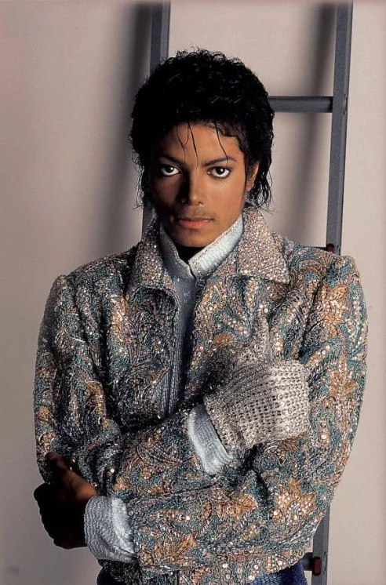

# King-of-Pop

## Michael Joseph Jackson

# Background
Michael Jackson was born August 29, 2019 in Gary, Indiana. He has been a performing with his brothers ever since he was 5 years old in the pop group The Jackson Five. While he a child star during the 70s, his breakthough came when he released his first adult album "Off the Wall" in 1979, establishing him as a very important icon in the Music Industry.

# Albums

Within his life as an Adult, Michael Jackson produced 6 standalone Albums:

- **Off the Wall**
- **Thriller**
- **Bad**
- **Dangerous**
- **HIStory: The Past, Present, and the Future**
- **Invincible**

# Accomplishments

- Michael Jackson's Thriller album currently holds the title as the Best-Selling Album Worldwide since 1984.

# Humanitarian Work

As much as he worked on Music, many of his works did not make the headlines. Michael Jackson spent several millions on charitable work. We are

# Tabloids and Deception

Jackson sadly was also subject to a stagerring amount of tabloids created to defame him over his career.